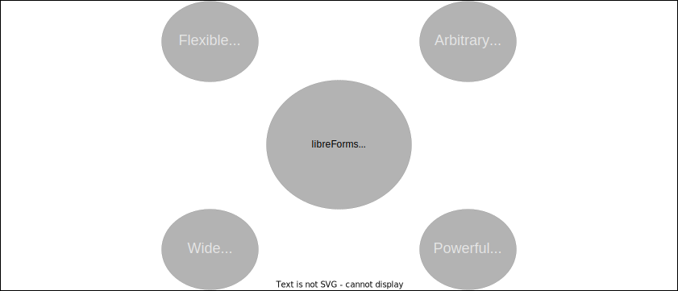

# libreForms
an open form manager API

Read the docs at [https://libreforms.readthedocs.io/en/latest/](https://libreforms.readthedocs.io/en/latest/).

## Contents
1. [about](#about)
    - [use cases](#use-cases)
    - [features](#features)
2. [installation](#installation)
    - [RHEL 8](#rhel-8)
    - [Ubuntu 20.04](#ubuntu-2004)
3. [Abstraction Layer](#abstraction-layer)
4. [Web Application](#web-application)
    - [Views](#views)
    - [Auth](#auth)
4. [Database](#database)
5. [Dependencies](#dependencies)
6. [Copyright](#copyright)

## About
Liberate your forms with libreForms, an open form manager API written in Python for organizations. 

Competing browser-based form managers give form administrators little control over form fields, the resulting data, or the underlying web application. Likewise, few options provide both self-hosting support and a viable licensing model.

The libreForms project, first and foremost, defines a simple but highly extensible abstraction layer that matches form fields to data structures. It adds a highly configurable browser-based application and a document-oriented database on top of this abstraction layer. 



### Use Cases
- You are a small enterprise that has been using Google Forms for your organization's internal forms because it is low-cost, but you dislike the restricted features and lack of direct control over your data.

- You are a medium-sized enterprise that wants a simple, low-cost tool to manage their internal forms. You don't mind self-hosting the application, and you have staff with rudimentary experience using Python to deploy and maintain the system.

- You are a large enterprise with significant technical staff that routinely host and maintain applications for use on your organization's intranet. You periodically rely on physical or digitized forms, reports, and questionnaires. You have assessed options for form managers on the market and determined that proprietary services provide little direct control over the application source code, or otherwise fail to provide a viable licensing model.

### Features
- a form-building abstraction layer based on Python dictionaries
- a flask web application (http://x.x.x.x:8000/) that will work well behind most standard reverse-proxies 
- plotly dashboards for data visualization
- a document-oriented database to store form data 
- basic local authentication
- \[future\] SAML authentication support
- \[future\] support for lookups in form fields & routing lists for form review, approvals, and notifications

## Installation

In most cases, the following commands must be run with root privileges.

### RHEL 8

0. install dependencies

```
# see https://www.mongodb.com/docs/manual/tutorial/install-mongodb-on-red-hat/
echo "[mongodb-org-5.0] 
name=MongoDB Repository 
baseurl=https://repo.mongodb.org/yum/redhat/$releasever/mongodb-org/5.0/x86_64/ 
gpgcheck=1 
enabled=1 
gpgkey=https://www.mongodb.org/static/pgp/server-5.0.asc" | tee /etc/yum.repos.d/mongodb-org-5.0.repo
yum update -y
yum install python3.8 mongodb-org -y
systemctl enable --now mongodb
```

1. Download this repository into the opt directory.

Either download a stable release of the application.

```
cd /opt
wget https://github.com/signebedi/libreForms/archive/refs/tags/X.X.X.tar.gz
tar -xvf *.*.*.tar.gz
mv libreForms-*.*.*/ libreForms/
```

Or install the cutting-edge version of the application using Git.

```
cd /opt
git clone https://github.com/signebedi/libreForms.git
```

2. install Python virtual environment and initialize flask

```
cd /opt/libreForms
python3.8 -m venv venv
source venv/bin/activate
pip install -r requirements.txt
export FLASK_APP=app
flask init-db
```

3. libreforms user

```
useradd --no-create-home --system libreforms
chown -R libreforms:libreforms /opt/libreForms
```

4. systemd service

```
cp /opt/libreForms/gunicorn/libreforms.service /etc/systemd/system
systemctl daemon-reload
systemctl enable --now libreforms
```

### Ubuntu 20.04

0. install dependencies

```
apt update -y && apt upgrade -y
apt install -y mongodb python3-pip python3-venv # for the most up to date version of mongodb, see https://www.mongodb.com/docs/manual/tutorial/install-mongodb-on-ubuntu/
systemctl enable --now mongodb
```

1. Download this repository into the opt directory:

Either download a stable release of the application.

```
cd /opt
wget https://github.com/signebedi/libreForms/archive/refs/tags/X.X.X.tar.gz
tar -xvf *.*.*.tar.gz
mv libreForms-*.*.*/ libreForms/
```

Or install the cutting-edge version of the application using Git.

```
cd /opt
git clone https://github.com/signebedi/libreForms.git
```

2. install Python virtual environment and initialize flask

```
cd /opt/libreForms
python3 -m venv venv
source venv/bin/activate
pip install -r requirements.txt
export FLASK_APP=app
flask init-db
```

3. libreforms user

```
useradd --no-create-home --system libreforms
chown -R libreforms:libreforms /opt/libreForms
```

4. systemd service

```
cp /opt/libreForms/gunicorn/libreforms.service /etc/systemd/system
systemctl daemon-reload
systemctl enable --now libreforms
```

if you experience a failure when you check `systemctl status libreforms`, then try chowning the program files and restarting the application.

```
chown -R libreforms:libreforms /opt/libreForms
systemctl restart libreforms
```


## Abstraction Layer

libreForms provides a simple but highly extensible method of form building in Python, leveraging Flask's doctrine of 'simplicity and extensibility' to give significant control and flexibility to organizations to design forms and data that meet their needs. To accomplish this, the application is built on an abstraction layer that stores all the information needed to generate a browser-based form and parse form data into a cohesive data structure.

The libreForms abstraction layer is defined in ```libreforms/forms/__init__.py``` and expects organizations to overwrite the default form by adding a file called ```libreforms/add_ons.py```. At this time, the abstraction layer can handle the "text", "password", "radio", "checkbox", "date", "hidden", and "number" input types, and can write to Python's str, float, int, and list data types. 

The abstraction layer breaks down individual forms into fields and configurations. A field must have a unique name, which must employ underscores instead of spaces ("My Form Field" would not work, but "My_Form_Field" is a correct field name). Configuration names are preceded by an underscore (eg. "_dashboard" or "_allow_repeats") and allow form administrators to define unique form behavior. All built in configurations default to a value of False.

Here is an overview of the abstraction layer in versions below `1.0.0`. Specifically, the following snippet defines a single form called `sample-form` with a handful of fields like `Text_Field`, `Pass_Field`, etc. and add a dashboard view for the form using the `_dashboard` configuration.

```python
forms = {
    "sample-form": {
        "Text_Field": {
            "input_field": {"type": "text", "content": ["NA"]},
            "output_data": {"type": "str", "required": False, "validators": [lambda p: len(p) >= 6]},
        },
        "Pass_Field": {
            "input_field": {"type": "password", "content": [""]},
            "output_data": {"type": "str", "required": False, "validators": []},
        },
        "Radio_Field": {
            "input_field": {"type": "radio", "content": ["Pick", "An", "Option"]},
            "output_data": {"type": "str", "required": False, "validators": []},
        },
        "Check_Field": {
            "input_field": {"type": "checkbox", "content": ["Pick", "An", "Option"]},
            "output_data": {"type": "list", "required": False, "validators": []},
        },
        "Date_Field": {
            "input_field": {"type": "date", "content": [datetime.datetime.today().strftime("%Y-%m-%d")]},
            # "input_field": {"type": "date", "content": []},
            "output_data": {"type": "str", "required": False, "validators": []},
        },
        "Hidden_Field": {
            "input_field": {"type": "hidden", "content": ["This field is hidden"]},
            "output_data": {"type": "str", "required": False, "validators": []},
        },
        "Float_Field": {
            "input_field": {"type": "number", "content": [0]},
            "output_data": {"type": "float", "required": False, "validators": []},
        }, 
        "Int_Field": {
            "input_field": {"type": "number", "content": [0]},
            "output_data": {"type": "int", "required": False, "validators": []},
        }, 
        "_dashboard": {             # defaults to False
            "type": "scatter",      # this is a highly powerful feature but requires
            "fields": {             # some knowledge of plotly dashboards; currently
                "x": "Timestamp",   # only line charts with limited features supported
                "y": "Int_Field", 
                "color": "Text_Field"
            }
        },
        "_allow_repeat": False, # defaults to False
        "_allow_uploads": True, # defaults to False
        "_allow_csv_templates": True, # defaults to False
        "_suppress_default_values": False, # defaults to False
    },
}
```

Versions above `1.0.0` will introduce compatibility-breaking changes that are intended to simplify the abstraction layer. For more information, see the [discussion](https://github.com/signebedi/libreForms/issues/27) about these changes.

```python
forms = {
    "sample-form": {
        "Text_Field": {
            "input_data_type": "text", 
            "content": ["NA"],
            "output_data_type": "str", 
            "options": {
                 "validators": [lambda p: len(p) >= 6],
                 "required": True,
                 "PLACEHOLDER_FOR_REPETITION_LOGIC":  True, 
                 "INSERT_OTHER_ARBITRARY_KWARGS_HERE": True,
            },
        },
    },
}
```

## Web Application

A Flask web application sits atop the libreForms abstraction layer defined above. This application includes basic authentication, provides access to forms, tables of form responses, and dashboards when these have been defined in the abstraction layer.

### Views

The application provides table and dashboard views for form data. Right now, line graphs are the only supported form of Plotly dashboard but, in the future, the project plans to allow arbitrary dashboard configurations using kwargs in the `_dashboard` configuration in the abstraction layer. The application allows users to tailor the data in their dashboards and tables using GET variabes as selectors. For example, when you define a dashboard for a given form, you need to set a dependent variable. However, this can be overridden by passing the ```?y=field_name``` GET variable in the browser. Likewise, you can tailor tabular data by passing the ```?FIELD_NAME=VALUE``` GET variable in the browser. Put another way, if a table has a field called ```Sub-Unit``` and another called Fiscal_Year, and you would like to tailor the table to only show data for the Finance sub-unit in the 2021 fiscal year, then you could pass the following GET variables: ```?Sub-Unit=Finance&Fiscal_Year=2021``` to select only this data.

In addition, the default site display options can be overridden by adding a file called `site_overrides.py` to the `app/` directory. This file should contain a dictionary object with key-value attributes that you want to override. 

```
display = {
    'site_name':"My-Site",
    'homepage_msg': "Welcome to My-Site. Select a view from above to get started.",
    'warning_banner':"Please be mindful of the data you post on this system.",
    'favicon':"my_new_favicon.ico",
    'default_org':"My Organization's Name",
}
```

### Auth

By default, this application employs an sqlite user database. The default login credentials are 

```
User: libreforms
Pass: libreforms
```

In addition to username and password fields, the application ships by default with phone number, organization, and email fields. These can be modified by changing the fields defined in app/schema.sql and app/auth.py. Currently, there is no group-based permission sets defined, but these will be added per https://github.com/signebedi/libreForms/issues/16.

### REST

There is a RESTful API that allows users to complete read and, perhaps in the future, write operations against the MongoDB database, see discussion [here](https://github.com/signebedi/libreForms/issues/36). This requires API keys. You can create a file in the application home directory called `api_keys` structured as:
```
api_keys
YOUR_KEY_HERE
```
But if you don't, the default test key will be `t32HDBcKAAIVBBPbjBADCbCh`. In the future, we may choose to manage API keys, along with signed URLs, using a database, see [here](https://github.com/signebedi/libreForms/issues/40).


## Database

When data is written from the web application to the database backend, it appends the following fields:

    - _id: unique id for each db write
    - Reporter: the username of the reporting user
    - Timestamp: the timestamp that the form was submitted

If you elect to password protect your database, which is recommended, you should drop a file in the application home directory named ```mongodb_pw``` and ensure that the ```libreforms``` user has read access to this file.


## Dependencies

The flask application has a few dependencies that, in its current form, may be prone to obsolescence; there is an issue in the backlog to test for, among other things, obsolete and vulnerable dependencies. In addition to the standard requirements, like Python3, Python3-Pip, Python3-Venv, and MongoDB, here is a list of dependencies that ship with the application under the static/ directory:

```
bootstrap-darkly-5.1.3.min.css
bootstrap-5.1.3.bundle.min.js
plotly-v1.58.5.min.js
```

As well as the following python requirements and their dependencies:

```
pandas==1.4.3
plotly==5.9.0
Flask==2.1.2
Flask-Admin==1.6.0
webargs==8.1.0
gunicorn==20.1.0
pymongo==4.1.1
```

In the development requirements file, we add the following requirements:

```
SQLAlchemy
Flask-Login
Bootstrap-Flask
```

In the tests requirements file, we add the following requirements

```
coverage
pytest
```

## Copyright

```
libreForms is an open form manager API
Copyright (C) 2022 Sig Janoska-Bedi

This program is free software: you can redistribute it and/or modify
it under the terms of the GNU Affero General Public License as
published by the Free Software Foundation, either version 3 of the
License, or (at your option) any later version.

This program is distributed in the hope that it will be useful,
but WITHOUT ANY WARRANTY; without even the implied warranty of
MERCHANTABILITY or FITNESS FOR A PARTICULAR PURPOSE.  See the
GNU Affero General Public License for more details.

You should have received a copy of the GNU Affero General Public License
along with this program.  If not, see <https://www.gnu.org/licenses/>.
```
